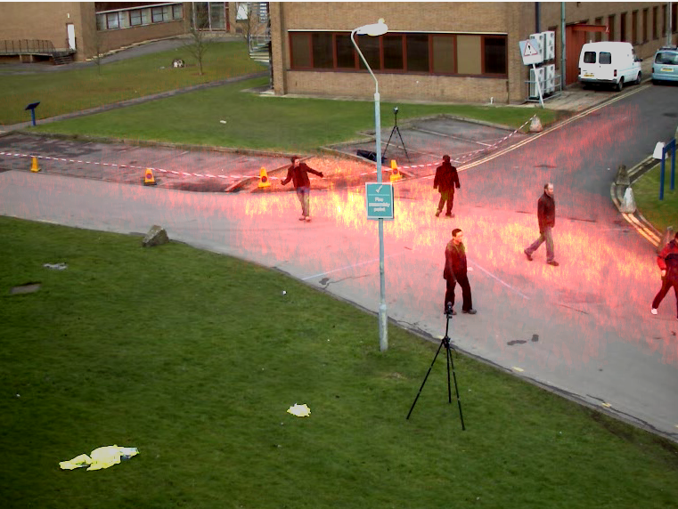

# Heatmap using OpenCV and Python

cretaing heatmap for moving objects from a static camera

## Steps
1. creating video capture object
2. creating a mask(heatmap) to apply heatmap on the video
3. taking difference of the consecutive frames using a while loop
