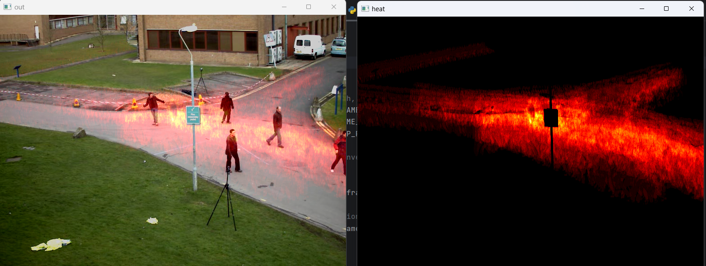

# Heatmap using OpenCV and Python

A simple project on cretaing heatmap for moving objects from a static camera

## Steps
1. creating video capture object
2. creating a mask(heatmap) to apply heatmap on the video
3. taking difference of the consecutive frames using a while loop
4. removing noises
5. applying the difference on heatmap and noramilizing it 
6. applying [colormap](https://docs.opencv.org/3.4/d3/d50/group__imgproc__colormap.html)
7. adding colormap to the output

## output

## Contact
📫 Reach me via [linkedIn](inkedin.com/in/ansil-m-b-2b14b9194/)  
📧 Mail me at ansilproabl@gmail.com
